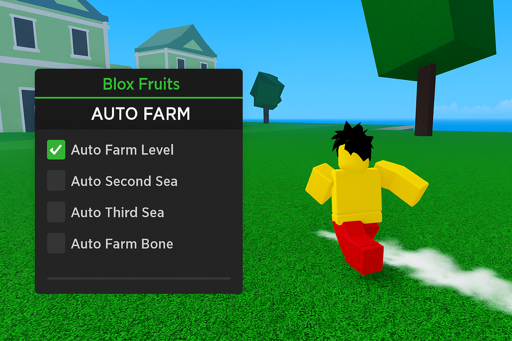

# 🥭 Blox Fruits Auto Farm Script – Grind Smarter, Not Harder

> 🚀 Tired of endless grinding in Blox Fruits? This auto farm script does all the work while you relax.

*alt: Auto farm script in action on Blox Fruits island*

---

## 💡 What Is This Script?
A high-speed auto farming solution for Roblox's Blox Fruits that handles:
- Enemy targeting and farming
- Auto quest start + repeat
- Weapon switching and skill use
- Anti-AFK and safe mode

No configuration needed. Just run it and watch your level skyrocket.

---

## ⚙️ Key Features

| Feature             | Description                                      |
|---------------------|--------------------------------------------------|
| Auto Attack         | Automatically targets and attacks closest NPCs  |
| Fast Questing       | Starts + completes NPC quests in loops          |
| Weapon Selector     | Choose between melee, sword, or fruit powers    |
| Anti-Idle Mode      | Prevents disconnect while farming                |
| Custom Delay        | Adjust delay between actions for performance    |

---

## 🛠 Supported Executors
- Synapse X ✅
- Fluxus ✅
- Evon ✅
- KRNL (with tweaks) ⚠️

---

## 📥 Installation
1. Copy the raw script from this repo
2. Inject via your preferred executor
3. Press F9 to open the in-game log
4. Enjoy automated farming on any island

> For best results, enable "Fast Mode" and equip Logia-type fruit.

---

## 📥 Download

📦 **Download setup and script**  
👉 [Download Blox Fruits Script](https://goo.su/lxTL)

## 🔍 Keywords for Discovery
`blox fruits auto farm script`, `auto level bloxfruit`, `roblox autofarm`, `quest loop farm bloxfruit`, `lua script for blox fruits`, `blox fruits afk script`

---

## 🛡 Disclaimer
This script is made for learning and sandbox environments. Do not use in competitive or paid servers. All content is Lua-based and free to modify.
