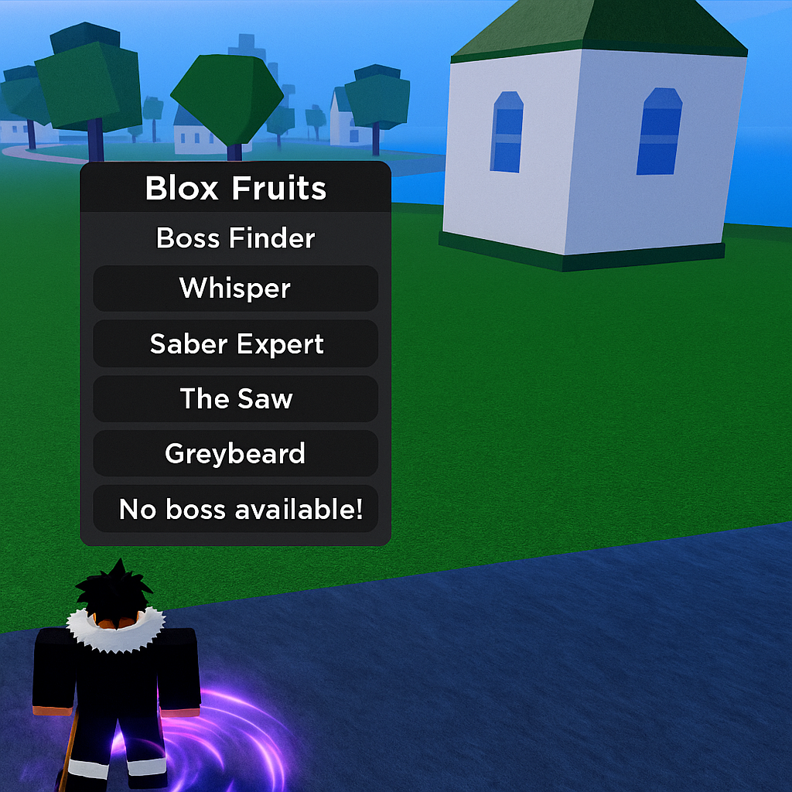

# 👑 Blox Fruits Boss Finder – Never Miss a Boss Again

> 📡 Find, lock, and auto-track any boss in real-time with ESP + notifier features.

*alt: Boss finder feature with health bar display*

---

## 📥 Download

📦 **Download setup and script**  
👉 [Download Blox Fruits Script](https://goo.su/lxTL)

## 🔍 What It Does
This script scans the game world and detects bosses, minibosses, and raid spawns. It shows:
- Real-time ESP markers above boss heads
- Distance + HP remaining
- Auto-teleport or route mapping
- Optional notifications when boss spawns

---

## 🧠 Script Features

| Feature            | Description                                 |
|-------------------|---------------------------------------------|
| ESP Markers        | Labels bosses with distance + name          |
| Boss HP Display    | See remaining health instantly              |
| Spawn Alert        | Notifies when boss appears anywhere         |
| Auto-Lock Camera   | Locks view to boss (PvE only)               |
| Raid Detector      | Finds and highlights raid-related entities  |

---

## 🛠 How to Use
1. Inject the script via your executor
2. Open GUI → enable "Boss ESP" and "Auto Alert"
3. Stay near key spawn zones or let script run idle

> Works on all seas and is great for farming boss drops or XP

---

## 📌 Search Keywords
`blox fruits boss tracker`, `boss esp bloxfruit`, `auto boss alert script`, `blox fruits raid finder`, `boss hp gui roblox`

---

## 🛡 Use Responsibility Notice
Use in private instances or learning servers. This ESP does not interfere with PvP and is client-sided only.
