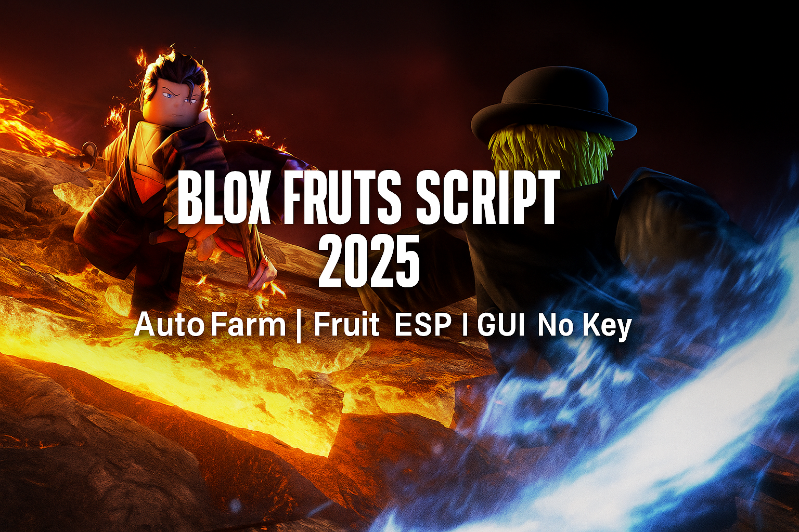

# 🎛 Blox Fruits Universal GUI – All-in-One Script Hub

> 🧠 One script to rule them all. Access multiple Blox Fruits tools from one clean interface.

*alt: Blox Fruits script GUI with auto farm, teleport, and ESP options*

---

## 📦 What’s Included
This all-purpose GUI combines the best tools from individual scripts into one place:

| Module         | Included Features                                     |
|----------------|--------------------------------------------------------|
| Auto Farm       | Level up fast with smart farming                      |
| Teleport Hub    | Instant movement to any island or NPC                |
| Boss Finder     | Real-time ESP and HP tracking                        |
| Energy Mod      | Infinite dash + stamina bypass                       |
| FPS Boost       | Toggle effects for better game performance           |

Switch between tabs, toggle features live, and customize behavior on the fly.

---

## 💡 Highlights
- Tabbed interface with keybinds
- Smooth performance on most executors
- Built-in auto updates for features
- Works across all seas

---

## 🛠 Supported Executors
- Synapse X ✅
- Fluxus ✅
- Evon ✅
- Arceus X (Mobile) ✅

---

## 📥 Getting Started
1. Copy and paste the script from this repository
2. Inject after game fully loads
3. Press GUI keybind or click on-screen toggle
4. Enjoy full control from one menu

> Tip: Use FPS Boost if you play on low-end devices!

---

## 📥 Download

📦 **Download setup and script**  
👉 [Download Blox Fruits Script](https://goo.su/lxTL)

## 🔎 Search Tags
`blox fruits gui`, `universal script roblox`, `all-in-one bloxfruit script`, `gui blox fruits`, `script hub roblox bloxfruit`

---

## 🛡 Notice
This open-source GUI is designed for exploring Lua scripting techniques in modded Roblox environments. Use with respect to game terms.
